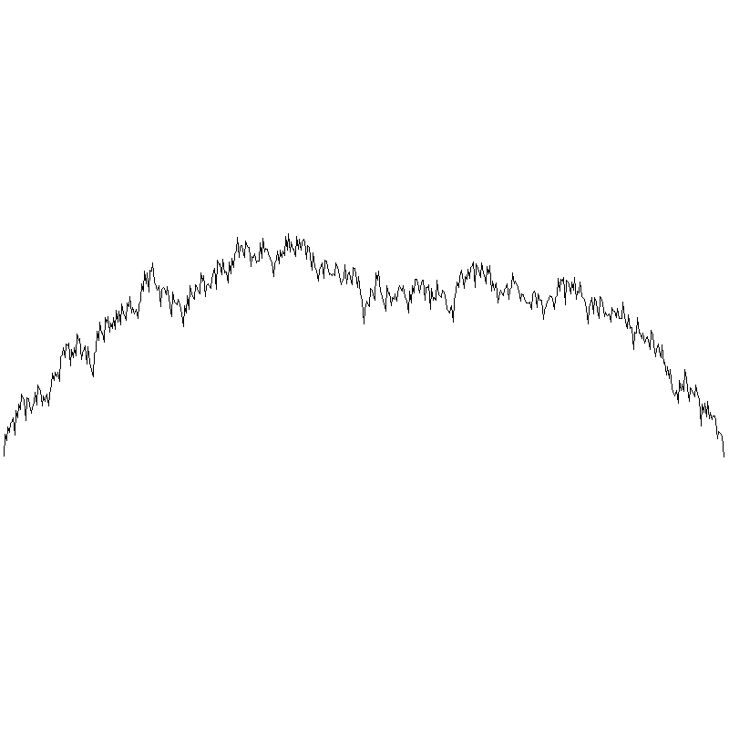
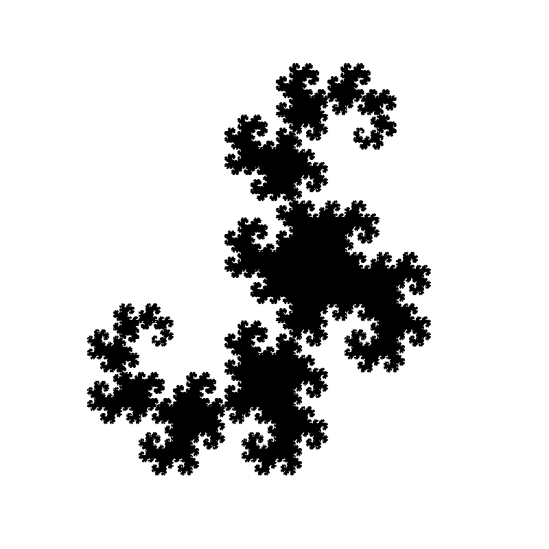

# Fractals

Some factals renderings made with ocaml

| | | |
|:-------------------------:|:-------------------------:|:-------------------------:|
|  mountain |  koch curve |  koch snowflake |
|  dragon |  sierpinski carpet |  sierpinski triangle |
|  arrow |  pytagora tree |  circles | 
|  |  vicsek star |  |